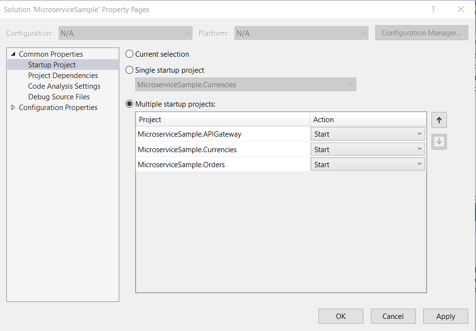
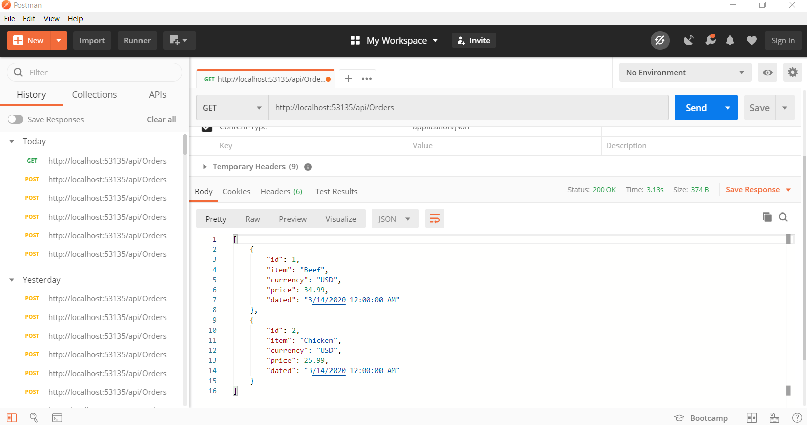

# MicroserviceSample
This is a sample project which i have created to understand the basics of Microservices using ASP.NET Core 3.1. The project contains two services
and an API Gateway. The project is not doing any special but instead aimed to create a POC. There are bunch of articles online to help you understand
and configure Microservices using Ocelot.

# Technologies Used
- C#.NET
- ASP.NET WEB API Core 3.1
- Ocelot (Open source API Gateway)

# How to run the project
The project is being developed using Microsoft Visual Studio 2019. The project contains three separate projects.

- MicroserviceSample.Orders (A service)
- MicroserviceSample.Currencies (A service)
- MicroserviceSample.APIGateway (Gateway for the services, created using Ocelot)

Open the solution using Visual Studio and run it. Before running the projects, right click on the main project, go to Properties, and set the all the three projects to
start simultaneously. Follow the screen shot given below.

Once project is running you will see three projects running. The two services has UI and API Gateway. Now, you can access the APIs using the API Gateway
port to access the services from a single unified point.

## Testing the project
There is not client developed as a part of this project as the actual purpose of this project is to create a POC. In order to test the project, download
Postman. Postman is a collaboration platform for API development and is free to download.
 
- [Postman](https://www.postman.com/downloads/)

